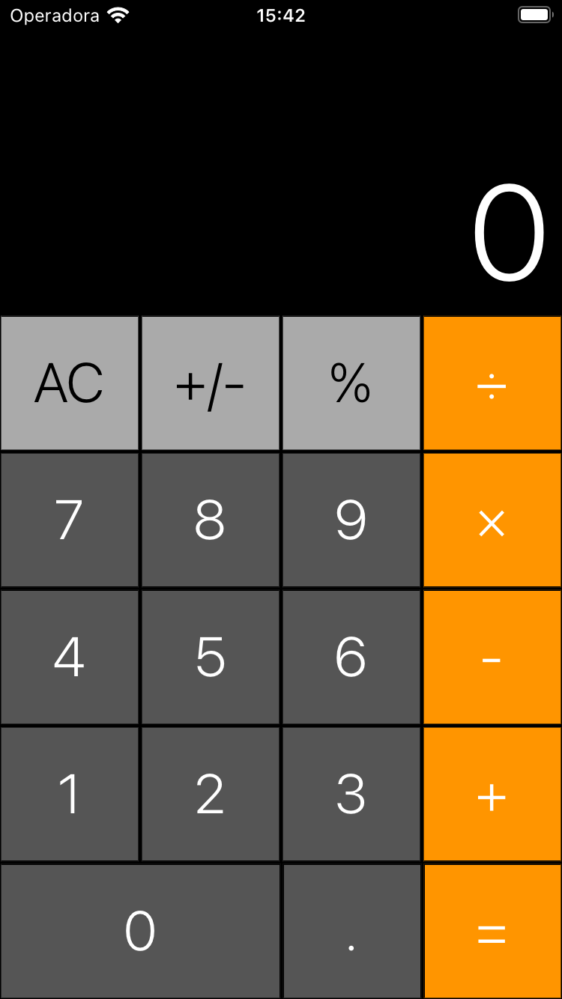
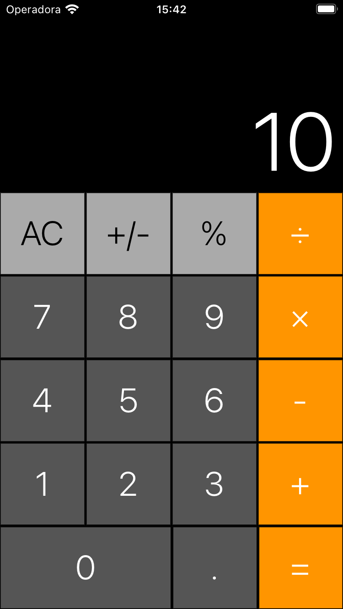
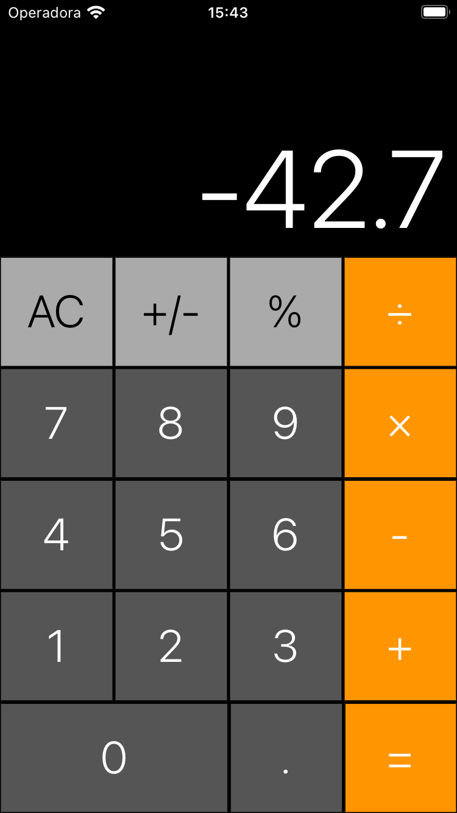
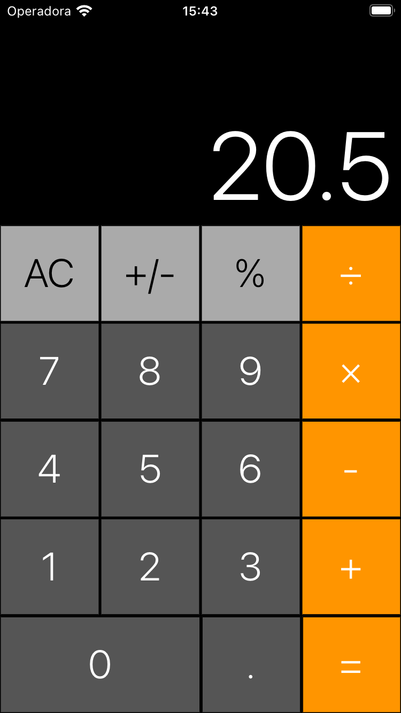
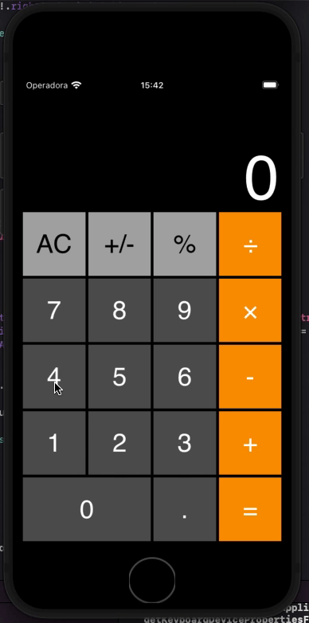

# Calculadora Storyboard

Construção de uma calculadora para iOS usando storyboard e swift.

Tutoriais usados como apoio:

[Build an iOS Calculator App – Tutorial Part 1](http://www.appbuildingblocks.com/build-ios-calculator-app-tutorial-part-1/)

[Como criar uma calculadora em Swift 5](https://tech-pt.netlify.app/articles/pt514108/index.html)

[Curso iOS: Módulo sobre view code](https://medium.com/@tpLioy/curso-ios-m%C3%B3dulo-sobre-view-code-af0f6188297b)

[View Code em Swift](https://medium.com/mackmobile/view-code-em-swift-6026f42bf780)

## Aplicativo

### Telas

<table>
    <tr>
        <td>
            
        </td>
        <td>
            
        </td>
        <td>
            
        </td>
        <td>
            
        </td>
    </tr>
    <tr>
        <td align="center">
            Tela Inicial
        </td>
        <td align="center">
            Valor positivo
        </td>
        <td align="center">
            Valor negativo
        </td>
        <td align="center">
            Valor decimal
        </td>
    </tr>
</table>

### Uso

### Próximos passo:

1. Melhorar função de operação
2. Colocar um label para mostrar a operação
3. Regra para não exibir o decimal quando for só inteiro
4. Fazer o AC virar C quando já tem o primeiro número
5. Testes
